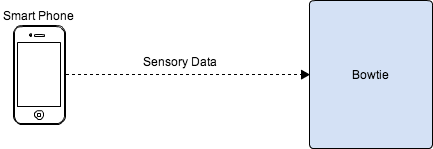

# Bowtie
Bowtie is a smartphone sensory data collector implemented in Go. To collect sensory
data, the smartphone is required to visit a HTML5 web page served by Bowtie.
Bowtie is capable of capturing:

- Accelerometer
- Gyroscope
- GPS
- Temperature
- Camera
- Microphone
- And more...

## Use cases
### Robotics
Our initial use case is to use Bowtie for robotics purposes. We realize there
is a large investment in terms of time and cost associated in developing the
electronics for robots, therefore we are attempting mitigate those barriers by
using what is already widely available, smartphones.

In particular a robot can utilize the phone's wide array of sensors without
having to resort to specialized sensors that are difficult to be reused for
other robots. Additionally given a swarm of robots using Bowtie, robots can
communicate and act as a collective based on data of each other.

### Crowd Sourcing
Crowd sourcing from multiple smartphones can be combined to build a
spatiotemporal view of the phenomenon of interest and also to extract important
community statistics. Given the ubiquity of mobile phones and the high density
of people in metropolitan areas, participatory sensing can achieve an
unprecedented level of coverage in both space and time for observing events of
interest in urban spaces.

## How Bowtie Works
Bowtie implements a client-server model. To make deployment simple, the client
(smartphone) is not required to install anything, the only requirement is for
the smartphone to use a HTML5 compliant web browser to visit the web page
Bowtie is currently serving.

## Requirements and Dependencies

- **[GO](http://golang.org/)** language

## Usage

    cd bowtie/server/
    go run bowtie_server.go -addr=<HOST ADDRESS> -port=<PORT USED>

## TODO
## Using a database
* Use a database instead of storing everything in files so further analysis of the data will be available
	* Using sqlite3 in Go is easy

## Administrator website
* Make admin website that can see all of the different phone nodes and their respective CPU Ids
	* Make bootsrap password and username field
	* Have drop down views using bootsrap

## User Login
* Allowing users to login for a certain CPU Id to see graphical data from the sensors and geolocation on maps
	* Look at Google API for maps
	* Find a way to make graphs in HTML5 so that they can be updated dynamically

### Phone Identifiers --> done
* Need to have a way to distinguish phone nodes for different robots
	* Setup a folder for each CPU identifier
	* Have a text field to enter the phone id
	* Once the CPU checkbox is unclicked, delete the JSON in the CPU id folder for the respective phone id
	* Nothing should be sending until both the phone id and the CPU id have been entered
