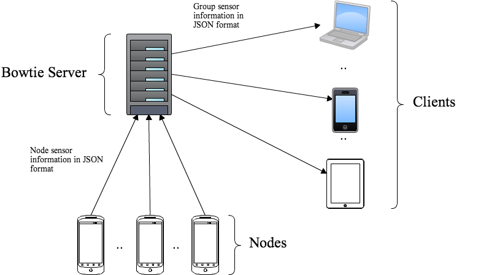
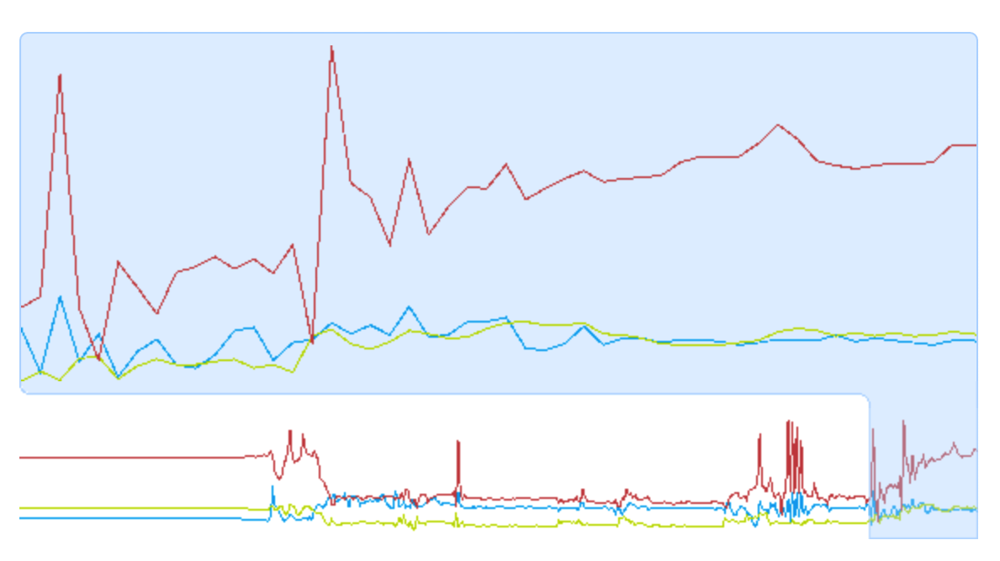
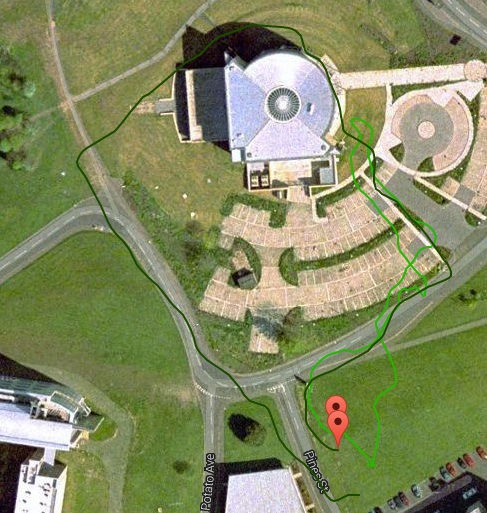
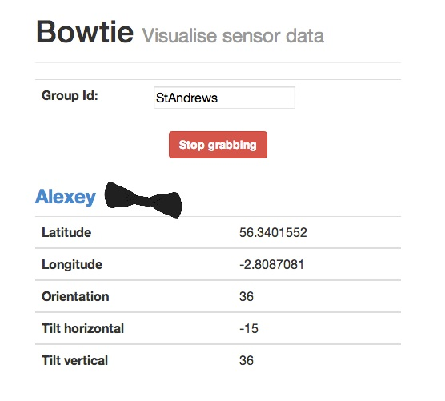

Bowtie: mobile device aided sensor acquisition
===========
** Abstract**

## Introduction

Bowtie is a large-scale sensor acquisition server which uses HTML5 and Go to send and retrieve sensor data to and from nodes. 

## Motivation
Mobile devices have advanced sensors built-in -- accelerometers, gyroscopes, GPS.
They are used for core functionality of the devices -- screen rotation, mapping.
The majority of the modern mobile platforms allow usage of additional external apps. External apps are able to use sensors through specialised APIs.

One of the approaches for creating mobile apps is to use HTML5 and Javascript for client side development. This approach allows the app to run in the phone’s browser or in a browser-based execution environment (e.g. Firefox OS). 
This approach has advantages – typically, a well written app will run on multiple platforms (e.g. iOS, Android, Windows Phone), since modern mobile platform typically have good support of HTML5 standards. Additionally, it is often convenient not having to install an app. In-browser apps are considered to be relatively secure (need sources to justify “relatively secure”), since Javascript execution is  usually sandboxed.
The disadvantages -- relatively (need sources to clarify “relatively”) bad performance (since sandboxing, single-threaded execution, lack of custom memory allocation). HTML apps can not utilise device-specific hardware (e.g. some phone come with thermometers attached to batteries), since the API’s for accessing them are not supported by the browser. 

Similar sensor combinations, like the those found on mobile devices, can be applied in other fields. 
For example, participants of amateur robotics competition use accelerometers to… {Alex Wallar}. Platforms like Arduino aim to simplify the acquisition of sensor data, however they are typically computationally limited and require beyond-basic understanding of software development.  
Crowdsourcing
Bowtie is a HTML5 app that collects the sensor data from mobile device(-s) and allows remote access to them through a simple API.

## Implementation

### Infrastructure

The picture above depicts the backend infrastructure of Bowtie. Data is collected from nodes using an HTML5 webpage and is sent to the server using a POST request. This data is then saved on the server in a unique file location. This file location is determined by the unique `Group Id` and `Node Id`. The `Group Id` is the identifier of the group of clients that are able to pull the sent data. Note that this does not mean a certain class of clients but a client name or identification. This acts a password as in clients that have this `Group Id` are able to pull this set of data. The `Node Id` identifies which node the data is being sent from. The `Group Id` and `Node Id` are sent with the POST request to the server and are explicit in the URL. 

Due to asynchronous file IO, clients are able to simultaneously retrieve the sensor data using a GET request as long as the client is in possesion of the `Group Id` for a group of nodes. Note that there is no direct connection between a node and a client. The server is used as a middle-man between the nodes and the clients. This increases the scalability of the proposed approach because the clients are not burdened by how many nodes are in the group. Likewise, a malfunctioning node will not corrupt the connection between the client and the server and thus there is a lower likelihood of system failure.

Bowtie uses a RESTful API to distribute and receive information from nodes. A RESTful API is a simple interface to interact with a server by specifying viable requests to prescribed URLs. Three different URLs were used and three different types of requests are served. 

#### Data Storage

As said before, the sensor data is stored in a unique file location. In early stages of the project, a RethinkDB database was used for storage. In this approach, the authors noticed that it was significantly slower than using file IO and therefore dropped the usage. The structure of the data storage used in Bowtie is as follows.

    json_data/
        <Group Id>/
            <Node Id>.json

The structure of the `<Node Id>.json` is:

    {
        <Sensor Name> : {
            Value : <JSON Object>,
            Type : <A string identifier of the type of JSON object used in `Value`>,
            Time : <A string timestamp from the node>
        }
    }

#### RESTful API

##### Retrieving Individual Sensor Data

    GET sensors/<Group Id>/<Node Id>/<Sensor Name>

This request causes the server to open the `json_data/<Group Id>/<Node Id>.json` file and parse it from JSON format into a Go dictionary. Then the value for the `Sensor Name` key in the dictionary is extracted, converted to JSON, and sent back to the client. The format of the response is:

    {
        Value : <JSON Object>,
        Type : <A string identifier of the type of JSON object used in `Value`>,
        Time : <A string timestamp from the node>
    }

#### Retrieving Node Data

    GET sensors/<Group Id>/<Node Id>

Retrieving node data causes the server to open `json_data/<Group Id>/<Node Id>.json` and sends the whole as bytes straight to the client. The response structure is as such:

    {
        <Sensor Name> : {
            Value : <JSON Object>,
            Type : <A string identifier of the type of JSON object used in `Value`>,
            Time : <A string timestamp from the node>
        }
    }

#### Retrieving Group Data

    GET sensors/<Group Id>

This request makes the server open all the files in `json_data/<Group Id>/` and parses it all into a Go dictionary. This dictonary is then parsed into JSON format and sent back to the client. The structure of reponse is:

    {    
        <Node Id> : {
            <Sensor Name> : {
                Value : <JSON Object>,
                Type : <A string identifier of the type of JSON object used in `Value`>,
                Time : <A string timestamp from the node>
            }
        }
    }

### Node application

Bowtie uses HTML5 APIs to acquire sensory data. The `navigator` object is used to recieve the geolocation data -- lattitude, longitude, direction. The `enableHighAccuracy` option was enabled, which forces to device to use the sensor compbination that ensures the best accuracy (defined by the specific OS). The `window` object allows to handle device orientation changes, making it possible to track device tilting (the majority of modern mobile devices have a built-in triple-axis accelerometer).

Since the node application attempts not to use any device- and platform-specific APIs (the audio and video features are currently Android-only, due to the lack of WebRTC support on other platforms), it is hightly cross-compatable beteween different different devices and platforms. Preliminary tests were held on iOS 6, Android 4.2-4.3, BlackBerry OS 6.
  
Envision.js Javascript library was used to visualise the triple-axis accelerometer data. The diagram is displayed once the sensing has started and provides visual feedback to the user. The update-rate of the diagram is set-to a high value (every 100 ms), which allows to update the chart in real-time.

## Application examples

### Search and Rescue (Realtime GPS Visualization)

Alexey walked around the management building (dark green line) and Alex tried to find him (light green line). The lines were plotted in real time by an external computer, non related to Bowtie.

### Realtime sensor acquisition

Data and visualization is pulled in real time.
As the node (in this case a phone) moves, the Bowtie is tilted and morphed. 
The data shown is being pulled from a node

## Scalability & Latency
Cannot offer objective measures on scalability only subjective
Software Architecture of Bowtie is not limited to anything
Most likely bottleneck is database/file storage

## Related work
- dʼAngelo, P. & Corke, P., 2002. Using a WAP phone as robot interface. Proceedings 2002 IEEE International Conference on Robotics and Automation Cat No02CH37292, 2(November), p.14-15.

    @INPROCEEDINGS{1014702, 
      author={d'Angelo, P. and Corke, P.}, 
      booktitle={Robotics and Automation, 2002. Proceedings. ICRA '02. IEEE International Conference on}, 
      title={Using a WAP phone as robot interface}, 
      year={2002}, 
      volume={2}, 
      pages={1173-1178}, 
      keywords={cellular radio;computerised monitoring;manipulators;remote procedure calls;telerobotics;transport protocols;4 joint hydraulic manipulator;WAP phone;micro-browsers;mobile phones;monitoring;online control;robot interface;Automatic control;Delay;HTML;Internet;Manufacturing automation;Mobile handsets;Mobile robots;Robot control;Robotics and automation;Wireless application protocol}, 
      doi={10.1109/ROBOT.2002.1014702},
    }

- Santos, A.C., Tarrataca, L. & Cardoso, J.M.P., 2009. An Analysis of Navigation Algorithms for Smartphones Using J2ME. In Bonnin Jm And Giannelli C And Magedanz T, eds. MOBILE WIRELESS MIDDLEWARE OPERATING SYSTEMS AND APPLICATIONS. SPRINGER, pp. 266-279.

    @incollection{
      year={2009},
      isbn={978-3-642-01801-5},
      booktitle={MobileWireless Middleware, Operating Systems, and Applications},
      volume={7},
      series={Lecture Notes of the Institute for Computer Sciences, Social Informatics and Telecommunications Engineering},
      editor={Bonnin, Jean-Marie and Giannelli, Carlo and Magedanz, Thomas},
      doi={10.1007/978-3-642-01802-2_20},
      title={An Analysis of Navigation Algorithms for Smartphones Using J2ME},
      url={http://dx.doi.org/10.1007/978-3-642-01802-2_20},
      publisher={Springer Berlin Heidelberg},
      keywords={Embedded computing; navigation algorithms; visual landmark recognition; particle filter; potential fields;      mobile robotics; smartphones; J2ME},
      author={Santos, AndréC. and Tarrataca, Luís and Cardoso, JoãoM.P.},
      pages={266-279}
    }

- Das, T. et al., 2010. PRISM : Platform for Remote Sensing using Smartphones. In PRism. ACM, pp. 63-76. Available at:http://research.microsoft.com/pubs/131575/mobi096-das.pdf.

    @inproceedings{
      Das:2010:PPR:1814433.1814442,
      author = {Das, Tathagata and Mohan, Prashanth and Padmanabhan, Venkata N. and Ramjee, Ramachandran and Sharma, Asankhaya},
      title = {PRISM: platform for remote sensing using smartphones},
      booktitle = {Proceedings of the 8th international conference on Mobile systems, applications, and services},
      series = {MobiSys '10},
      year = {2010},
      isbn = {978-1-60558-985-5},
      location = {San Francisco, California, USA},
      pages = {63--76},
      numpages = {14},
      url = {http://doi.acm.org/10.1145/1814433.1814442},
      doi = {10.1145/1814433.1814442},
      acmid = {1814442},
      publisher = {ACM},
      address = {New York, NY, USA},
      keywords = {mobile platform, mobile sandbox, opportunistic sensing, participatory sensing, smart phones},
    }

