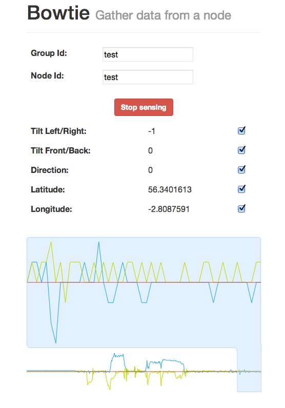
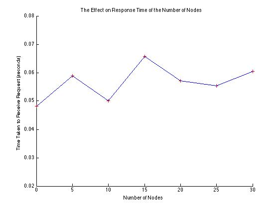

Bowtie: mobile device aided sensor acquisition
===========

#### Authors:

- School of Computer Science, Jack Cole Building, North Haugh, St Andrews, Fife KY16 9SX, Scotland, UK
    - Alex Wallar: aw204@st-andrews.ac.uk
    - Aleksejs Sazonovs: as245@st-andrews.ac.uk
    - Christopher Choi: cc218@st-andrews.ac.uk

- Catholic University of America ....
    - Erion Plaku: plaku@cua.edu

## Motivation
Mobile devices have advanced sensors built-in -- accelerometers, gyroscopes, GPS.
They are used for core functionality of the devices -- screen rotation, mapping.
The majority of the modern mobile platforms allow usage of additional external apps. External apps are able to use sensors through specialised APIs.

One of the approaches for creating mobile apps is to use HTML5 and Javascript for the client side development. This approach allows the app to run in the phone’s browser or in a browser-based execution environment (e.g. Firefox OS). 
This approach has advantages – typically, a well written app will run on multiple platforms (e.g. iOS, Android, Windows Phone), since modern mobile platform typically have good support of HTML5 standards. Additionally, it is often convenient not having to install an app. In-browser apps are considered to be relatively secure (need sources to justify “relatively secure”), since Javascript execution is  usually sandboxed.
The disadvantages -- relatively bad performance (since sandboxing, single-threaded execution, lack of custom memory allocation). HTML apps can not utilise device-specific hardware (e.g. some phone come with thermometers attached to batteries), since the API’s for accessing them are not supported by the browser. 

Similar sensor combinations, like the those found on mobile devices, can be applied in other fields. 
For example, participants of amateur robotics competition use accelerometers to plan the robots movements and make decisions. Platforms like Arduino aim to simplify the acquisition of sensor data, however they are typically computationally limited and require beyond-basic understanding of software development.  

Bowtie is a HTML5 app that collects the sensor data from mobile devices and allows remote access to them through a simple API.

## Implementation

### Infrastructure

The picture above depicts the backend infrastructure of Bowtie. Data is collected from nodes using an HTML5 webpage and is sent to the server using a POST request. This data is then saved on the server in a unique file location. This file location is determined by the unique `Group Id` and `Node Id`. The `Group Id` is the identifier of the group of clients that are able to pull the sent data. Note that this does not mean a certain class of clients but a client name or identification. This acts a password as in clients that have this `Group Id` are able to pull this set of data. The `Node Id` identifies which node the data is being sent from. The `Group Id` and `Node Id` are sent with the POST request to the server and are explicit in the URL. 

Due to asynchronous file IO, clients are able to simultaneously retrieve the sensor data using a GET request as long as the client is in possession of the `Group Id` for a group of nodes. Note that there is no direct connection between a node and a client. The server is used as a middle-man between the nodes and the clients. This increases the scalability of the proposed approach because the clients are not burdened by how many nodes are in the group. Likewise, a malfunctioning node will not corrupt the connection between the client and the server and thus there is a lower likelihood of system failure.

Bowtie uses a RESTful API to distribute and receive information from nodes. A RESTful API is a simple interface to interact with a server by specifying viable requests to prescribed URLs. Three different URLs were used and three different types of requests are served. 

#### Data Storage

As said before, the sensor data is stored in a unique file location. The structure of the data storage used in Bowtie is as follows.

    json_data/
        <Group Id>/
            <Node Id>.json
    
    video_data/
        <Group Id>/
            <Node Id>.jpg
    
    audio_data/
        <Group Id>/
            <Node Id>.wav

The structure of the `<Node Id>.json` is:

    {
        <Sensor Name> : {
            Value : <JSON Object>,
            Type : <A string identifier of the type of JSON object used in `Value`>,
            Time : <A string timestamp from the node>
        }
    }

#### Video and Audio Data Capture
In HTML5, the specification provides HTML tags to access the client's video and audio stream by just using the `<video>` and `<audio>` tags respectively. The method of obtaining data from both sources, however, is different compared to the other sensory data, such as location, device orientation and accelerometer, to gain access to video and audio, `getUserMedia()` from the JavaScript has to be executed in-order to ask permission to access both sources. In addition while access to both video and audio sources is possible, there is a limitation that the full raw stream of both sources cannot be directly transmitted to Bowtie as Raw data. Both the video and audio has to be sampled in short intervals to achieve real time "recording". Below we will briefly discuss how each data types are captured in Bowtie.

##### Capturing Video Data
HTML5 has a `video` tag, but to obtain the raw data one has to first write the video frame onto a `canvas`, from there using Javascript can obtain the `DataURI` a Uniform Resource Identifier (URI) scheme containing the raw data of a video frame. Traditionally it provides a way to include data in-line in web pages as if they were external resources, however we did the opposite, we extract the data as if they were included from external resource. Every frame of the video is drawn onto the `canvas` as a jpg, then each frame of jpg was encoded into Base64 encoding inorder for it to be included in a JSON to be transmitted to Bowtie.

In Summary:

1. `getUserMedia()` from Javascript to instanciate access to client's video stream (i.e. access to webcam)
2. Draw each video frame as jpg onto a `<canvas>` tag
3. Encode each jpg frame as Base64 encoding
4. Transmit data as part of a JSON message

##### Capturing Audio Data
The audio works similarly, however it uses a JavaScript library called [`Recorder.js`](https://github.com/mattdiamond/Recorderjs) by Matt Diamond to capture and record the audio in `wav` format. The audio is sampled every short interval, and is then encoded in Base64 before transmitting to Bowtie as part of a JSON message.

In Summary:

1. `getUserMedia()` from Javascript to instanciate access to client's audio stream (i.e. access to webcam)
2. Use Record.js to record a small duration of audio in `wav` format
3. Encode each `wav` slice as Base64 encoding
4. Transmit data as part of a JSON message

#### RESTful API

##### Retrieving Individual Sensor Data

    GET sensors/<Group Id>/<Node Id>/<Sensor Name>

This request causes the server to open the `json_data/<Group Id>/<Node Id>.json` file and parse it from JSON format into a Go dictionary. Then the value for the `Sensor Name` key in the dictionary is extracted, converted to JSON, and sent back to the client. The format of the response is:

    {
        Value : <JSON Object>,
        Type : <A string identifier of the type of JSON object used in `Value`>,
        Time : <A string timestamp from the node>
    }

#### Retrieving Node Data

    GET sensors/<Group Id>/<Node Id>

Retrieving node data causes the server to open `json_data/<Group Id>/<Node Id>.json` and sends the whole as bytes straight to the client. The response structure is as such:

    {
        <Sensor Name> : {
            Value : <JSON Object>,
            Type : <A string identifier of the type of JSON object used in `Value`>,
            Time : <A string timestamp from the node>
        }
    }

#### Retrieving Group Data

    GET sensors/<Group Id>

This request makes the server open all the files in `json_data/<Group Id>/` and parses it all into a Go dictionary. This dictonary is then parsed into JSON format and sent back to the client. The structure of reponse is:

    {    
        <Node Id> : {
            <Sensor Name> : {
                Value : <JSON Object>,
                Type : <A string identifier of the type of JSON object used in `Value`>,
                Time : <A string timestamp from the node>
            }
        }
    }

#### Sending Sensory Data

    POST sensors/<Group Id>/<Node Id>/<Sensor Name>

Posting data to the server for a sensors causes the `json_data/<Group Id>/<Node Id>.json` file to be created if it is not already. This file is then opened and parsed from JSON into a Go dictionary. Bowtie then redirects the sensory information into the correct key-value pair in this dictionary. Finally, the Go dictionary is converted to JSON and written to the `<Node Id>.json` file.

#### Sending Node Data

    POST sensors/<Group Id>/<Node Id>

Posting node data to the server opens `json_data/<Group Id>/<Node Id>.json` and parses it into a Go dictionary. The sensors that were posted with the node are updated in this Go dictionary. Then this dictionary is converted to JSON and written into the file.

#### Retrieving Node List

    GET nodes/<Group Id>

It is also important for some projects to simply get the list of nodes that are posting to a certain `Group Id`. This request causes the server to iterate through the files in the `json_data/<Group Id>` directory. Since each file name corresponds to a `Node Id`, a list of `Node Ids` can be generated. This is then sent back to the client. The structure of the response is:

    [ <Node Ids (Strings)> ]

#### Retrieving Media Data

    GET media/<Group Id>/<Node Id>/<Media Type>

Another feature of Bowtie is the ability for nodes (using HTML5) to send video and audio to the server. The media types (audio and video) are sent to the server using Websockets but are retrieved using a simple GET request. A new URL was added to the server to deal with these requests. Once the URL is requested, the `<Media Type>_data/<Group Id>/<Node Id>.<Media Extension>` file is opened where `Media Type` is either `video` or `audio` and the `Media Extension` corresponds to either `jpg` or `wav` respectively. The data is then sent back to the client in a format similar to the sensor response but more specific. The response format is depicted below:

    {
        Value : <Base 64 String>,
        Type : <Media Type>/base64,
        Time : <Timestamp for when the media was last edited>
    }

### Node application

Bowtie uses HTML5 APIs to acquire sensory data. The `navigator` object is used to receive the geolocation data -- latitude, longitude, direction. The `enableHighAccuracy` option was enabled, which forces to device to use the sensor combination that ensures the best accuracy (defined by the specific OS). The `window` object allows to handle device orientation changes, making it possible to track device tilting (many of modern mobile devices have a built-in triple-axis accelerometer (http://www.hotmobile.org/2012/papers/HotMobile12-final42.pdf)).

Since the node application attempts not to use any device- and platform-specific APIs (the audio and video features are currently Android-only, due to the lack of WebRTC support on other platforms), it is highly cross-compatible between different different devices and platforms. Preliminary tests were held on iOS 6, Android 4.2-4.3, BlackBerry OS 6.
  
Envision.js Javascript library was used to visualise the triple-axis accelerometer data. The diagram is displayed once the sensing has started and provides visual feedback to the user. The update-rate of the diagram is set-to a high value (every 100 ms), which allows to update the chart in real-time.

## Application examples

One of the aims of Bowtie -- to provide simplistic APIs to access the sensory data, since it is aimed at potentially novice developers. To illustrate the usability of APIs, some example applications were written. The apps demonstrate some potential use cases of Bowtie. 

### Search and Rescue (Realtime GPS Visualisation)

To demonstrate the geolocation-related functionality of Bowtie, a web-app was created. Using Google Maps API a map is drawn. The app utilises the RESTful API and shows the node current location (given that they share the longitude and latitude). When the nodes move, their path is dynamically plotted on the map in real-time. The app was used to demonstrate the Search and Rescue use-case.
 
User A walked around the management building (dark green line) and User B tried to find him (light green line). The lines were plotted in real time by an external computer, non related to Bowtie.

### Real-time sensor acquisition

In order to show that Bowtie can work for with an array of sensors, we created a webpage that uses the RESTful API to get sensor data for a group and visualize it in real-time. Picture below shows a bow tie being morphed to show the current tilt of the device. Also, other sensors such as orientation and GPS that are not being visualized have their raw values displayed on the page. All of this data is being sent and retrieved to and from the server in real-time. Also, please note that Bowtie supports multiple nodes in a group but there was not enough room to take a picture of this.

## Possible Uses

Since Bowtie is a message passing infrastructure, many possible uses in distributed robotics come to mind. For instance, a project coordinating a large group of bluetooth robots from a central computer would be able to gather sensor data including video and GPS from each of the bots using Bowtie by simply placing a browser-enabled device on each robot. This abstracts from having the implementer have to create their own infrastructure for message passing. Likewise, Bowtie relinquishes the burden on the user of having to know something about electrical engineering.

Bowtie may also be used in search and rescue scenarios. If a human (or robot) gets trapped in an irreversible configuration, they could start broadcasting to the server their position and a message detailing their condition. The robot could then use navigation techniques to find its way to the distressed individual and save them. What is novel about using Bowtie with this type of project is that Bowtie does not rely on the device in order to send information to the server. All Bowtie needs to work on the node side is a web browser.

Bowtie can also be used more broadly to include plain text messages. Instead of sending sensor data using the web application that was proposed in this paper, one could use the RESTful API and create their own sensor that POSTs data to the server. This data would get treated as any of the other sensor data would and therefore clients would be able to retrieve this data using the RESTful API. For instance, a WiFi-enabled controller on a robot would be able to make POST requests to the Bowtie server. The server would organize the data the same way and would therefore make it easy on the client side to do analysis or real-time manipulation of the robot.

## Scalability Test

We have tested the performance on a small-scale and widely available virtual server (as of September 2013, it cost roughly 5 US dollars per month to rent it). The server was equipped with a single core processor, 512 MB of RAM, and a 20 GB SSD disk. 

The test was intended to check if the responsiveness of Bowtie decreasing beyond the reasonable threshold, once a certain number of nodes are sending data. We selected 30 as a maximum number of nodes for one group during the test due to limited resources.

At its current stage of development, Bowtie is intended for the amateur roboticist to run their own server. This being said, we also have a live server intended for testing and proof of concept. In the future, a more powerful server will be used and larger scaled tests will be completed. At that point, Bowtie can be offerred as a service.

Below is the graph depicting the time delay for a GET request to the server and the number of nodes POSTing to that group. This data was acquired by establishing the said number of nodes POSTing to the same `Group Id` and having a client pull the data 100 times and taking the average amount of time for the request to go through.

## Related work
- dʼAngelo, P. & Corke, P., 2002. Using a WAP phone as robot interface. Proceedings 2002 IEEE International Conference on Robotics and Automation Cat No02CH37292, 2(November), p.14-15.

    `@INPROCEEDINGS{1014702, 
      author={d'Angelo, P. and Corke, P.}, 
      booktitle={Robotics and Automation, 2002. Proceedings. ICRA '02. IEEE International Conference on}, 
      title={Using a WAP phone as robot interface}, 
      year={2002}, 
      volume={2}, 
      pages={1173-1178}, 
      keywords={cellular radio;computerised monitoring;manipulators;remote procedure calls;telerobotics;transport protocols;4 joint hydraulic manipulator;WAP phone;micro-browsers;mobile phones;monitoring;online control;robot interface;Automatic control;Delay;HTML;Internet;Manufacturing automation;Mobile handsets;Mobile robots;Robot control;Robotics and automation;Wireless application protocol}, 
      doi={10.1109/ROBOT.2002.1014702},
    }`

- Santos, A.C., Tarrataca, L. & Cardoso, J.M.P., 2009. An Analysis of Navigation Algorithms for Smartphones Using J2ME. In Bonnin Jm And Giannelli C And Magedanz T, eds. MOBILE WIRELESS MIDDLEWARE OPERATING SYSTEMS AND APPLICATIONS. SPRINGER, pp. 266-279.

    `@incollection{
      year={2009},
      isbn={978-3-642-01801-5},
      booktitle={MobileWireless Middleware, Operating Systems, and Applications},
      volume={7},
      series={Lecture Notes of the Institute for Computer Sciences, Social Informatics and Telecommunications Engineering},
      editor={Bonnin, Jean-Marie and Giannelli, Carlo and Magedanz, Thomas},
      doi={10.1007/978-3-642-01802-2_20},
      title={An Analysis of Navigation Algorithms for Smartphones Using J2ME},
      url={http://dx.doi.org/10.1007/978-3-642-01802-2_20},
      publisher={Springer Berlin Heidelberg},
      keywords={Embedded computing; navigation algorithms; visual landmark recognition; particle filter; potential fields;      mobile robotics; smartphones; J2ME},
      author={Santos, AndréC. and Tarrataca, Luís and Cardoso, JoãoM.P.},
      pages={266-279}
    }`

- Das, T. et al., 2010. PRISM : Platform for Remote Sensing using Smartphones. In PRism. ACM, pp. 63-76. Available at:http://research.microsoft.com/pubs/131575/mobi096-das.pdf.

    `@inproceedings{
      Das:2010:PPR:1814433.1814442,
      author = {Das, Tathagata and Mohan, Prashanth and Padmanabhan, Venkata N. and Ramjee, Ramachandran and Sharma, Asankhaya},
      title = {PRISM: platform for remote sensing using smartphones},
      booktitle = {Proceedings of the 8th international conference on Mobile systems, applications, and services},
      series = {MobiSys '10},
      year = {2010},
      isbn = {978-1-60558-985-5},
      location = {San Francisco, California, USA},
      pages = {63--76},
      numpages = {14},
      url = {http://doi.acm.org/10.1145/1814433.1814442},
      doi = {10.1145/1814433.1814442},
      acmid = {1814442},
      publisher = {ACM},
      address = {New York, NY, USA},
      keywords = {mobile platform, mobile sandbox, opportunistic sensing, participatory sensing, smart phones},
    }`

